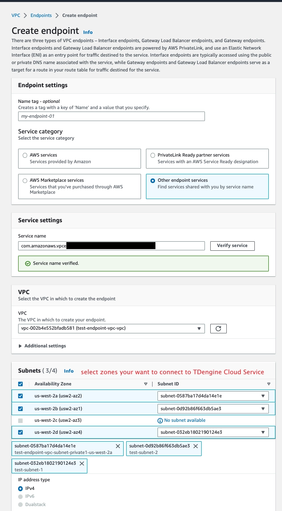

## Introduction
PrivateLink is a highly available, scalable technology that you can use to privately connect your application to TDengine Cloud instance with different VPCs. PrivateLink allows the application in your VPC to connect to TDengine Cloud instance through your private IP addresses, and no needs to expose your data to the public internet.

Currently, TDengine Cloud only supports private endpoint connections in AWS. Other clouds such as GCP or Azure will soon be supported.

The architecture of the PrivateLink is as follows:

<figcaption>Figure 1. Architecture of PrivateLink</figcaption>

For more details of the PrivateLink concept, please see the following AWS documents:  
[What is AWS PrivateLink?](https://docs.aws.amazon.com/vpc/latest/privatelink/what-is-privatelink.html)  
[AWS PrivateLink concepts](https://docs.aws.amazon.com/vpc/latest/privatelink/concepts.html)  

## How to use PrivateLink
### Step 1: choose a endpoint service name in TDengine Cloud
1. Open [Network](https://console.cloud.tdengine.com/network) page in TDengine Cloud, Click **Service List** button.
2. Record the **Service Name** from the list of services in the correct cloud and region for later usage.

### Step 2: Set up a private endpoint with AWS

To use the AWS Management Console to create a VPC interface endpoint, please follow these steps:

1. Sign in to the [AWS Management Console](https://aws.amazon.com/console/) and open the Amazon VPC console at [AWS VPC](https://console.aws.amazon.com/vpc/).
2. Select the region where your VPC is located from the drop-down list in the upper-right corner. Find **Virtual private cloud** in the left navigation pane and Click **Endpoints**, and then click **Create Endpoint** in the upper-right corner. The **Create endpoint** page is displayed.

   
   
<figcaption>Figure 2. Create Endpoint</figcaption>

3. Select Other endpoint services.
4. Enter the service name that you choose in **Step 1**. Click **Verify service**.
5. Select your VPC in the drop-down list. 
6. In the Subnets area, select all the availability zones, and select the Subnet ID.
7. Select your security group properly in the Security groups area.
   :::note IMPORTANT
   Make sure the selected security group allows inbound access from your EC2 instances on port 443.

   :::
8. Click Create endpoint. Then you have the **VPC endpoint ID**.

### Step 3: Create endpoint connection using TDengine Cloud
1. In TDengine Cloud left navigation panel, select **Network**, then choose the **PrivateLink** tab, click **Add New Private Link** in the upper-right corner. The **Add New Private Link** page will be displayed.
2. Input your preferred connection name, select the correct endpoint service to use to create the connection, and then enter the **Endpoint ID** you created in step 2.
3. Click the **Verify** button to verify if the request existed and could be accepted. 
4. Click the **Add** button to create the private endpoint connection.
5. You can find the connection info in the connection list in PrivateLink page.
6. Wait a few minutes, then refresh the page to see the connection status is CONNECTED.
7. The connection have three statuses: CONNECTED, DISCONNECTED and PENDING. When the operation is in progress, the connection status is PENDING. You need to wait a few minutes for the operation to complete.

### Step 4: Enable private DNS names in AWS
1. Click the endpoint id link in **Endpoints** page you created in Step 2 on AWS.
2. Click **Actions**  in the upper-right area of the page and then select **Modify private DNS name**.
3. Check the box **Enable for this endpoint** and then click **Save changes**.
4. Then you can find the **Private DNS names** shown in **Endpoint Details** page.

### Step 5: Using the private DNS name to call TDengine Cloud Service
Now you can access TDengine Cloud instance in your VPC using the private DNS name. You can find the **Private URL** in the [Instances page](https://console.cloud.tdengine.com/instances) in TDengine Cloud.

## How to remove the endpoint connection
1. Click the **Actions** button in **endpoint connection list** page in TDengine Cloud. After a while, the connection status will be changed into DISCONNECTED.
2. Delete the connection in  **endpoint connection list** page in TDengine Cloud. 
3. Remove the private endpoint in the AWS Console. Otherwise, AWS will continue to charge.
   1. Select the endpoint in **Endpoints** page in AWS.  
   2. Click **Actions**  in the upper-right area of the page and then select **Delete VPC Endpoints**.
