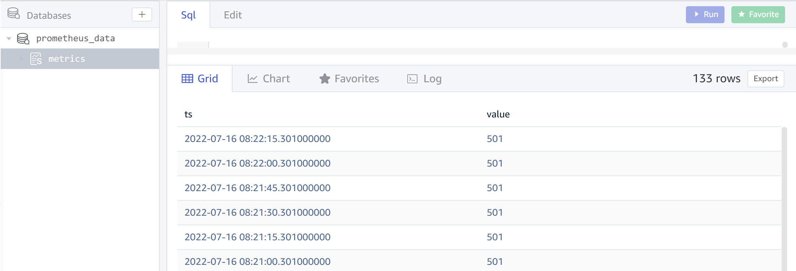

Prometheus 是一款流行的开源监控告警系统。Prometheus 于2016年加入了 Cloud Native Computing Foundation （云原生云计算基金会，简称 CNCF），成为继 Kubernetes 之后的第二个托管项目，该项目拥有非常活跃的开发人员和用户社区。

Prometheus 提供了 `remote_write` 和 `remote_read` 接口来利用其它数据库产品作为它的存储引擎。为了让 Prometheus 生态圈的用户能够利用 TDengine 的高效写入和查询，TDengine 也提供了对这两个接口的支持。

通过适当的配置， Prometheus 的数据可以通过 `remote_write` 接口存储到 TDengine 中，也可以通过 `remote_read` 接口来查询存储在 TDengine 中的数据，充分利用 TDengine 对时序数据的高效存储查询性能和集群处理能力。

## 前置条件

登录到 TDengine Cloud，在左边的菜单点击”数据浏览器“，然后再点击”数据库“标签旁边的”+“按钮添加一个名称是”prometheus_data“使用默认参数的数据库。然后执行 `show databases` SQL确认数据库确实被成功创建出来。

## 安装 Prometheus

假设您使用的是 amd64 架构的 Linux 操作系统：
1. 下载
    ```
    wget https://github.com/prometheus/prometheus/releases/download/v2.37.0/prometheus-2.37.0.linux-amd64.tar.gz
    ```
2. 解压和重命名
   ```
   tar xvfz prometheus-*.tar.gz && mv prometheus-2.37.0.linux-amd64 prometheus
   ```  
3. 改变目录为 prometheus
   ```
   cd prometheus
   ```

然后 Prometheus 就会被安装到当前目录. 想了解更多 Prometheus 安装选型，请参考[官方文档](https://prometheus.io/docs/prometheus/latest/installation/).

## 配置 Prometheus

可以通过编辑 Prometheus 配置文件 `prometheus.yml` 来设置 Prometheus （如果您完全按照上面的步骤执行，您可以在当前目录找到 prometheus.xml 文件）。

```yaml
remote_write:
  - url: "<cloud_url>/prometheus/v1/remote_write/prometheus_data?token=<cloud_token>"

remote_read:
  - url: "<cloud_url>/prometheus/v1/remote_read/prometheus_data?token=<cloud_token>"
    remote_timeout: 10s
    read_recent: true
```

<!-- exclude -->
您可以使用真实的 TDengine Cloud 的URL和令牌来替换上面的`<url>`和`<token>`。可以通过访问[TDengine Cloud](https://cloud.taosdata.com)来获取真实的值。
<!-- exclude-end -->

配置完成后，Prometheus 会从自己的 HTTP 指标端点收集数据并存储到 TDengine Cloud 里面。

## 启动 Prometheus

```
./prometheus --config.file prometheus.yml
```

之后 Prometheus 应该已经启动好。同时也启动了一个 Web 服务器<http://localhost:9090>。如果您想从浏览器访问这个 Web 服务器， 可以根据您的网络环境修改 `localhost` 为正确的主机名，FQDN 或者 IP 地址。

## 验证远程写入

登录 TDengine Cloud，然后点击左边导航栏的”数据浏览器“。您就会看见由 Prometheus 收集的指标数据。


:::note

- TDengine 会根据一定规则自动为子表名创建唯一的 IDs。
:::
