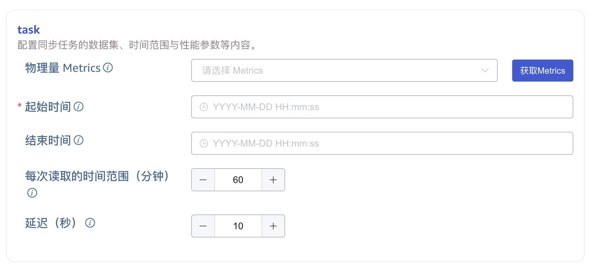

本节讲述如何通过 Explorer 界面创建数据迁移任务, 从 OpenTSDB 迁移数据到当前 TDengine 集群。

## 功能概述

OpenTSDB 是一个架构在 HBase 系统之上的实时监控信息收集和展示平台。TDengine 可以通过 OpenTSDB 连接器高效地读取 OpenTSDB 中的数据，并将其写入 TDengine，以实现历史数据迁移或实时数据同步。

任务在运行过程中会保存进度信息到硬盘上，因此如果暂停任务后重新启动，或任务自动从异常中自动恢复，任务并不会从头开始进行。更多选项建议详细阅读创建任务页面每个表单字段的说明。

## 创建任务

### 1. 新增数据源

在数据写入页面中点击左上角的 **+新增数据源** 按钮进入新增数据源页面，如下图所示：

### 2. 配置基本信息

在 **名称** 字段中输入任务名称，例如 *`test_opentsdb_01`* 。

选择 **类型** 下拉框中的 *`OpenTSDB`* ，如下图所示（选择完成后页面中的字段会发生变化）。

**代理** 是非必填项，如有需要，可以在下拉框中选择指定的代理，也可以先点击右侧的 **+创建新的代理** 按钮 [创建一个新的代理](../../explorer/#创建新的代理) 。

**目标数据库** 是必填项，由于 OpenTSDB 存储数据的时间精度是毫秒，所以这里需要选择一个 *`毫秒精度的数据库`* ，也可以先点击右侧的 **+创建数据库** 按钮 [创建一个新的数据库](../../explorer/#创建数据库) 。

### 3. 配置连接信息

在 **连接配置** 区域填写 *`源 OpenTSDB 数据库的连接信息`*，如下图所示：

在 **连接配置** 区域的下方有一个 **连通性检查** 按钮，用户可以点击此按钮检查上方填写的信息是否可以正常获取源 OpenTSDB 数据库的数据，检查结果如下图所示：  
  **失败**  
    
  **成功**  
  

### 4. 配置任务信息

**物理量 Metrics** 是 OpenTSDB 数据库中存储数据的物理量，用户可以指定多个需要同步的物理量，未指定则同步数据库中的全部数据。如果用户指定物理量，需要先点击右侧的 **获取 Metrics** 按钮获取当前源 OpenTSDB 数据库的所有物理量信息，然后在下拉框中进行选择，如下图所示：

**起始时间** 是指源 OpenTSDB 数据库中数据的起始时间，起始时间的时区使用 explorer 所选时区，此项为必填字段。

**结束时间** 是指源 OpenTSDB 数据库中数据的截止时间，当不指定结束时间时，将持续进行最新数据的同步；当指定结束时间时，将只同步到这个结束时间为止，结束时间的时区使用 explorer 所选时区，此项为可选字段。

**每次读取的时间范围（分钟）** 是连接器从源 OpenTSDB 数据库中单次读取数据时的最大时间范围，这是一个很重要的参数，需要用户结合服务器性能及数据存储密度综合决定。如果范围过小，则同步任务的执行速度会很慢；如果范围过大，则可能因内存使用过高而导致 OpenTSDB 数据库系统故障。

**延迟（秒）** 是一个范围在 1 到 30 之间的整数，为了消除乱序数据的影响，TDengine 总是等待这里指定的时长，然后才读取数据。

### 5. 配置高级选项

**高级选项** 区域是默认折叠的，点击右侧 `>` 可以展开，如下图所示：

### 6. 创建完成

点击 **提交** 按钮，完成创建 OpenTSDB 到 TDengine 的数据同步任务，回到[数据源列表](../../explorer/#数据写入)页面可查看任务执行情况。