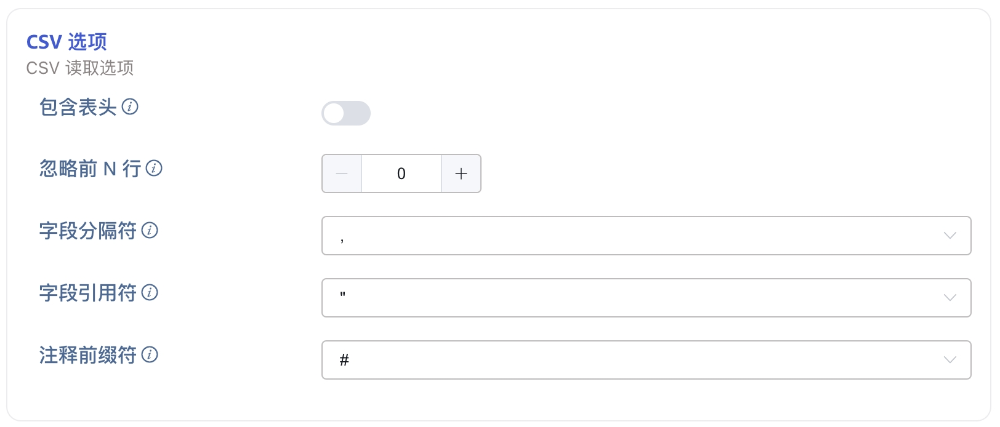
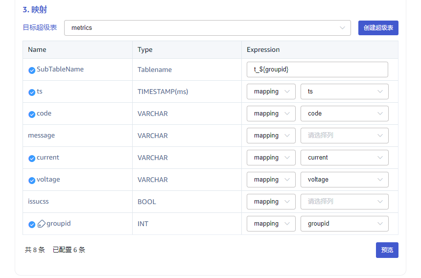

本节讲述如何通过 Explorer 界面创建数据迁移任务, 从 CSV 迁移数据到当前 TDengine 集群。

## 功能概述
导入一个或多个 CSV 文件数据到 TDengine。

## 创建任务
### 1. 新增数据源
在数据写入页面中，点击 **+新增数据源** 按钮，进入新增数据源页面。

### 2. 配置基本信息
在 **名称** 中输入任务名称，如：“test_csv”；

在 **类型** 下拉列表中选择 **CSV**。

在 **目标数据库** 下拉列表中选择一个目标数据库，也可以先点击右侧的 **+创建数据库** 按钮 [创建一个新的数据库](../../explorer/#创建数据库) 。

### 3. 配置 CSV 选项
在 **包含表头** 区域点击开启或关闭，如果包含表头，则第一行将被视为列信息。

在 **忽略前 N 行** 区域填写 N，表示忽略 CSV 文件的前 N 行。

在 **字段分隔符** 区域进行选择，CSV 字段之间的分隔符，默认是 “,” 。

在 **字段引用符** 区域进行选择,当 CSV 字段中包含分隔符或换行符时，用于包围字段内容，以确保整个字段被正确识别,默认是 "“"。

在 **注释前缀符** 区域进行选择,当 CSV 文件中某行以此处指定的字符开头，则忽略该行默认是 “#”。

### 4. 配置解析 CSV 文件
在本地上传 CSV 文件，例如：test-json.csv，之后会使用这条示例 csv 文件来配置提取和过滤条件。

#### 4.1 解析

点击 **选取文件** 后，选择 test-json.csv，点击 **解析** 预览识别的列。

**预览解析结果**

#### 4.2 字段拆分

在 **从列中提取或拆分** 中填写从消息体中提取或拆分的字段，例如：将 message 字段拆分成 `text_0` 和 `text_1` 这2个字段，选择 split 提取器，seperator 填写 -, number 填写2。
点击 **删除**，可以删除当前提取规则。
点击 **新增**，可以添加更多提取规则。

点击 **放大镜图标** 可预览提取或拆分结果。

<!-- 在 **过滤** 中，填写过滤条件，例如：填写 `id != 1`，则只有 id 不为 1 的数据才会被写入 TDengine。
点击 **删除**，可以删除当前过滤规则。

点击 **放大镜图标** 可查看预览过滤结果。

 -->

#### 4.3 表映射

在 **目标超级表** 的下拉列表中选择一个目标超级表，也可以先点击右侧的 **创建超级表** 按钮 [创建超级表](#创建超级表) 。

在 **映射** 中，填写目标超级表中的子表名称，例如：`t_${groupid}`。

点击 **预览**，可以预览映射的结果。

### 5. 创建完成

点击 **提交** 按钮，完成创建 CSV 到 TDengine 的数据同步任务，回到[数据源列表](../../explorer/#数据写入)页面可查看任务执行情况。
