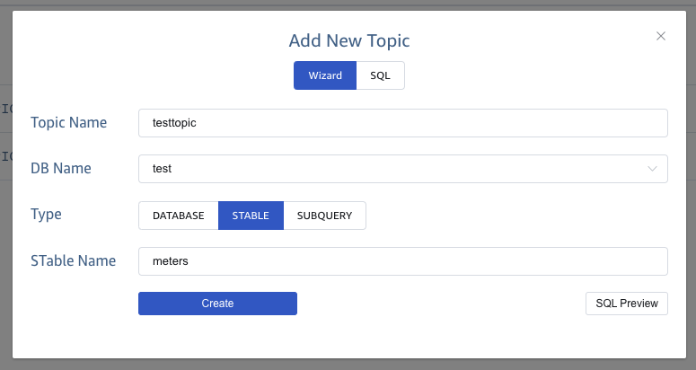
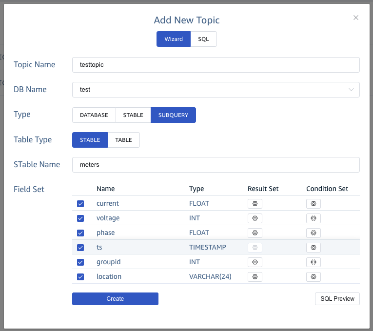
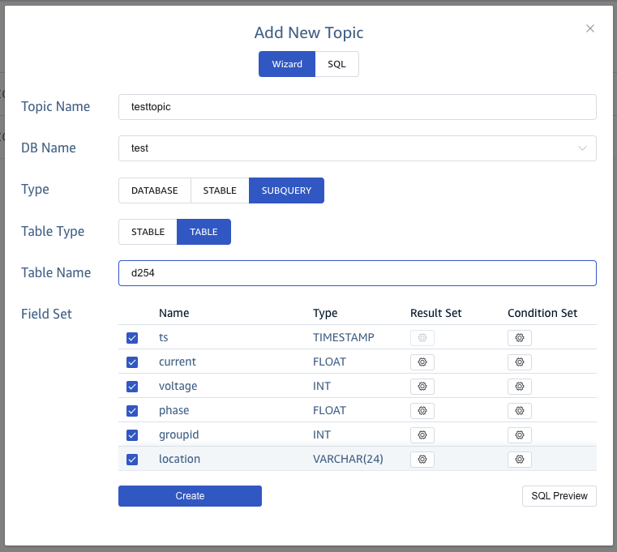
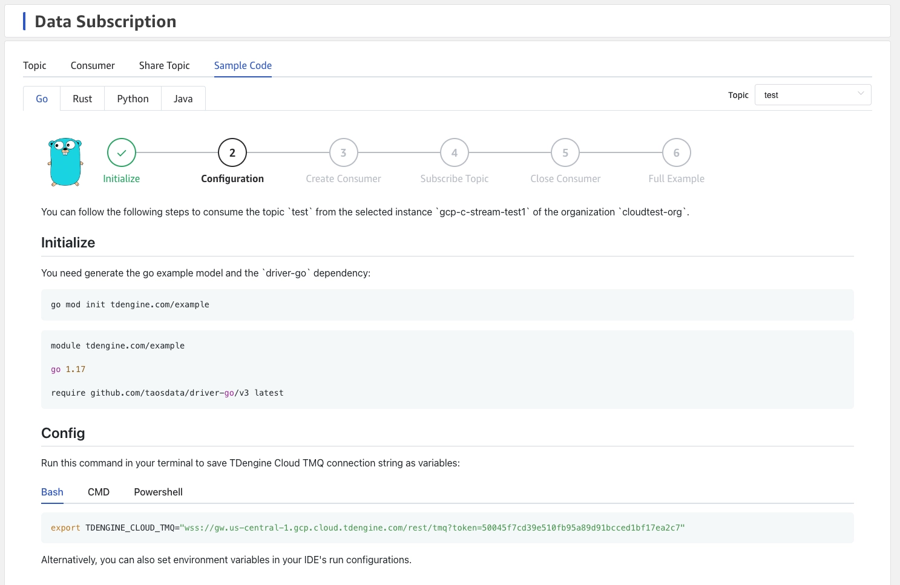

import Tabs from "@theme/Tabs";
import TabItem from "@theme/TabItem";

TDengine 提供类似于消息队列产品的数据订阅和消费接口。这些接口使应用程序更容易获取实时写入 TDengine 的数据，并且按照事件发生的顺序处理数据。这简化了您的时序数据处理系统，并降低了您的成本，无需要部署像 Kafka 这样的消息队列产品。

您可以像在 Kafka 中使用主题一样来使用 TDengine 数据订阅。不同的是，TDengine 的主题是基于现有的超级表、表或子表的查询条件来定义的，也就是一个简单的 SELECT 语句。您可以使用 SQL 语言通过标签、表名、列或表达式来过滤数据，然后对数据执行标量函数或用户自定义的函数，暂不支持聚合函数。这些特性使 TDengine 数据订阅比类似产品有更多的灵活性，并且数据的颗粒度可以由应用程序自己按需控制，而过滤和预处理则由 TDengine 而不是应用程序处理。这种实现方式大大减少了传输的数据量和应用程序的复杂性。

通过订阅一个主题，消费者可以实时获得该主题的最新数据。并且多个消费者可以组成一个消费者组，共同消费这些数据。消费者组通过多线程、分布式数据消费能够实现更快的速度。请注意，订阅同一主题的不同组的消费者不会一起消费消息。一个消费者可以订阅多个主题。如果超级表中的数据被分散在多个虚拟节点中，消费者组可以比单个消费者更有效地消费它。TDengine 还包括一个确认机制，在机器可能崩溃或重启的复杂环境中确保至少一次完成消费。

该主题介绍了如何通过 TDengine Cloud 的访问控制管理和每个支持的连接器的订阅接口来共享 TDengine 实例的数据。数据所有者只需要通过创建主题，将想分享数据的用户或用户组添加到主题的订阅者。主题的订阅者就可以从 TDengine 获得关于如何以数据订阅方式访问共享数据的细节。在本文件中，我们将简要地解释数据共享的这些主要步骤。

## 创建主题

您可以在 TDengine Cloud 的数据订阅菜单中创建主题。在创建主题的对话框中，您可以选择向导或者 SQL 方式来创建主题。在向导方式下，您需要输入主题名称并选择当前 TDengine 实例的数据库。然后选择超级表或者指定超级表或子表的子查询。您也可以添加字段选择或为每个字段添加结果函数和过滤条件。下面，您可以了解如何通过向导方式在创建三种主题。

### 数据库

**添加新主题**对话框中的默认选择是**数据库**类型。在选择**数据库**后，您可以点击**确认**按钮，为数据库创建一个主题。


### 超级表

在打开的**添加新主题**对话框中，您可以点击**超级表**类型并从选择中选择一个指定的超级表。然后点击**确认**按钮，为超级表创建一个主题。


### 子查询

在打开的**添加新主题**对话框中，您可以点击**子查询**类型来显示所有的子查询表项目。第一个项目是表类型，默认选择是**超级表**。在您选择或输入一个超级表的名称后，下面将显示超级表的所有字段。您可以为子查询勾选或取消勾选每个字段，也可以为每个字段设置结果函数或过滤条件。如果您想预览最终生产的 SQL 语句，请点击**SQL 预览**按钮，打开一个 SQL 对话框来预览。


您可以选择另一个表表，然后从选择框中选择一个表，或者输入一个存在的表名，就可以获得所选表的所有字段。您可以为子查询勾选或取消勾选每个字段，也可以为每个字段设置结果函数或过滤条件。如果您想预览最终生产的 SQL 语句，请点击**SQL 预览**按钮，打开一个 SQL 对话框来预览。


## 共享主题

在主题页面中，您可以点击共享主题的操作图标，进入共享主题页面。您也可以直接点击**共享主题**选项卡来切换到正确的位置。在**共享主题**选项卡中的**可消费该主题的用户**页面， 您可以获得消费该主题的一个分享。

### 可消费该主题的用户

在**共享主题**页面的默认标签**可消费该主题的用户**中，您可以点击**添加可消费该主题的用户**按钮来添加更多在当前组织中活跃的用户。在打开的**添加新用户**对话框中，您可以选择您想分享主题的新用户，并设置分享给这些用户的过期时间。


### 可消费该主题的用户组

您可以点击**可消费该主题的用户组**标签，切换到共享主题的用户组页面。然后您可以点击**添加可消费该主题的用户组**按钮，添加更多在当前组织中活跃的用户组。在打开的**添加新用户组**对话框中，您可以选择您想共享主题的新用户组，并设置共享给这些用户组的过期时间。


## 消费共享的主题

当共享用户进入数据订阅的主题页面时，他可以获得创建者与他共享的所有主题。用户可以点击每个主题的**示例代码**图标，进入**示例代码**页面的操作区域。然后，他可以按照示例代码的步骤，从 TDengine 实例消费共享主题。


### 数据模型和应用接口
<!-- markdownlint-disable MD033 -->
下面会介绍多种语言的相关数据模型和应用接口
<Tabs defaultValue="Go" groupId="lang">

<TabItem label="Go" value="Go">

```go
func NewConsumer(conf *Config) (*Consumer, error)

func (c *Consumer) Close() error

func (c *Consumer) Commit(ctx context.Context, message unsafe.Pointer) error

func (c *Consumer) FreeMessage(message unsafe.Pointer)

func (c *Consumer) Poll(timeout time.Duration) (*Result, error)

func (c *Consumer) Subscribe(topics []string) error

func (c *Consumer) Unsubscribe() error
```

</TabItem>

<TabItem label="Rust" value="Rust">

```rust
impl TBuilder for TmqBuilder
  fn from_dsn<D: IntoDsn>(dsn: D) -> Result<Self, Self::Error>
  fn build(&self) -> Result<Self::Target, Self::Error>

impl AsAsyncConsumer for Consumer
  async fn subscribe<T: Into<String>, I: IntoIterator<Item = T> + Send>(
        &mut self,
        topics: I,
    ) -> Result<(), Self::Error>;
  fn stream(
        &self,
    ) -> Pin<
        Box<
            dyn '_
                + Send
                + futures::Stream<
                    Item = Result<(Self::Offset, MessageSet<Self::Meta, Self::Data>), Self::Error>,
                >,
        >,
    >;
  async fn commit(&self, offset: Self::Offset) -> Result<(), Self::Error>;

  async fn unsubscribe(self);
```

了解更多详情，请点击[Crate taos](https://docs.rs/taos)。
</TabItem>

<TabItem value="Python" label="Python">

```python
class TaosConsumer():
    def __init__(self, *topics, **configs)

    def __iter__(self)

    def __next__(self)

    def sync_next(self)
    
    def subscription(self)

    def unsubscribe(self)

    def close(self)
    
    def __del__(self)
```

</TabItem>
<TabItem value="Java" label="Java">

```java
void subscribe(Collection<String> topics) throws SQLException;

void unsubscribe() throws SQLException;

Set<String> subscription() throws SQLException;

ConsumerRecords<V> poll(Duration timeout) throws SQLException;

void commitSync() throws SQLException;

void close() throws SQLException;
```

</TabItem>
</Tabs>

### 配置 TDengine DSN

您必须先为 GO 语言和 RUST 语言设置下面的内容
<Tabs defaultValue="Bash" groupId="config">
<TabItem value="Bash" label="Bash">

```shell
export TDENGINE_CLOUD_TMQ="<TDENGINE_CLOUD_TMQ>"
```

</TabItem>
<TabItem value="CMD" label="CMD">

```shell
set TDENGINE_CLOUD_TMQ=<TDENGINE_CLOUD_TMQ>
```

</TabItem>
<TabItem value="Powershell" label="Powershell">

```powershell
$env:TDENGINE_CLOUD_TMQ='<TDENGINE_CLOUD_TMQ>'
```

</TabItem>
</Tabs>

:::note 非常重要
请使用实际值替换<TDENGINE_CLOUD_TMQ>，格式类似于`wss://<cloud_endpoint>)/rest/tmq?token=<token>`。获取`TDENGINE_CLOUD_TMQ`的实际值，请登录[TDengine Cloud](https://cloud.taosdata.com)，然后在左边菜单点击**数据订阅**，然后再想消费的主题旁边的**示例代码**操作图标进入该主题的**示例代码**部分。
:::

对于 Python 语言，您需要设置下面的环境变量：
<Tabs defaultValue="Bash" groupId="config">
<TabItem value="Bash" label="Bash">

```shell
export TDENGINE_CLOUD_ENDPOINT="<TDENGINE_CLOUD_ENDPOINT>"
export TDENGINE_CLOUD_TOKEN="<TDENGINE_CLOUD_TOKEN>"
```

</TabItem>
<TabItem value="CMD" label="CMD">

```shell
set TDENGINE_CLOUD_ENDPOINT=<TDENGINE_CLOUD_ENDPOINT>
set TDENGINE_CLOUD_TOKEN=<TDENGINE_CLOUD_TOKEN>
```

</TabItem>
<TabItem value="Powershell" label="Powershell">

```powershell
$env:TDENGINE_CLOUD_ENDPOINT='<TDENGINE_CLOUD_ENDPOINT>'
$env:TDENGINE_CLOUD_TOKEN='<TDENGINE_CLOUD_TOKEN>'
```

</TabItem>
</Tabs>

:::note 非常重要
请使用实际值替换<TDENGINE_CLOUD_ENDPOINT>和<TDENGINE_CLOUD_TOKEN>。获取这些实际值，请登录[TDengine Cloud](https://cloud.taosdata.com)，然后在左边菜单点击**数据订阅**，然后在想消费的主题旁边的**示例代码**操作图标进入该主题的**示例代码**部分，最后切换到 Python 标签页。
:::

最后对于 Java 语言，您需要设置下面的环境变量：
<Tabs defaultValue="Bash" groupId="config">
<TabItem value="Bash" label="Bash">

```shell
export TDENGINE_JDBC_URL="<TDENGINE_JDBC_URL>"
```

</TabItem>
<TabItem value="CMD" label="CMD">

```shell
set TDENGINE_JDBC_URL=<TDENGINE_JDBC_URL>
```

</TabItem>
<TabItem value="Powershell" label="Powershell">

```powershell
$env:TDENGINE_JDBC_URL='<TDENGINE_JDBC_URL>'
```

</TabItem>
</Tabs>

:::note 非常重要
请使用实际值替换<TDENGINE_JDBC_URL>, 格式类似于`jdbc:TAOS-RS://<cloud_endpoint>)?useSSL=false&token=<token>`。获取这些实际值，请登录[TDengine Cloud](https://cloud.taosdata.com)，然后在左边菜单点击**数据订阅**，然后在想消费的主题旁边的**示例代码**操作图标进入该主题的**示例代码**部分，最后切换到 Java 标签页。
:::

### 从实例创建消费者

消费者需要通过一系列配置选项创建，基础配置项如下表所示：

|            参数名称            |  类型   | 参数说明                                                 | 备注                                        |
| :----------------------------: | :-----: | -------------------------------------------------------- | ------------------------------------------- |
|        `td.connect.ip`         | string  | TDengine Cloud 实例的连接值，如“gw.cloud.taosdata.com”。                        |                                             |
|       `td.connect.token`        | string  | TDengine Cloud 实例的令牌值。                        |                                             |
|           `group.id`           | string  | 消费组 ID，同一消费组共享消费进度                        | **必填项**。最大长度：192。                 |
|          `client.id`           | string  | 客户端 ID                                                | 最大长度：192。                             |
|      `auto.offset.reset`       |  enum   | 消费组订阅的初始位置                                     | 可选：`earliest`(default), `latest`, `none` |
|      `enable.auto.commit`      | boolean | 是否启用消费位点自动提交                                 | 合法值：`true`, `false`。                   |
|   `auto.commit.interval.ms`    | integer | 以毫秒为单位的消费记录自动提交消费位点时间间             | 默认 5000 m                                 |
| `enable.heartbeat.background`  | boolean | 启用后台心跳，启用后即使长时间不 poll 消息也不会造成离线 | 默认开启                                    |
|     `msg.with.table.name`      | boolean | 是否允许从消息中解析表名, 不适用于列订阅（列订阅时可将 tbname 作为列写入 subquery 语句）               | |

对于不同编程语言，其设置方式如下：

<Tabs defaultValue="Go" groupId="lang">

<TabItem label="Go" value="Go">

```go
import (
  "github.com/taosdata/driver-go/v3/common"
  tmqcommon "github.com/taosdata/driver-go/v3/common/tmq"
  "github.com/taosdata/driver-go/v3/ws/tmq"
)
tmqStr := os.Getenv("TDENGINE_CLOUD_TMQ")
consumer, err := tmq.NewConsumer(&tmqcommon.ConfigMap{
  "ws.url":                tmqStr,
  "ws.message.channelLen": uint(0),
  "ws.message.timeout":    common.DefaultMessageTimeout,
  "ws.message.writeWait":  common.DefaultWriteWait,
  "group.id":              "test_group",
  "client.id":             "test_consumer_ws",
  "auto.offset.reset":     "earliest",
})
if err != nil {
  panic(err)
}
```

</TabItem>

<TabItem label="Rust" value="Rust">

```rust
let tmq_str = std::env::var("TDENGINE_CLOUD_TMQ")?;
let tmq_uri = format!( "{}&group.id=test_group_rs&client.id=test_consumer_ws", tmq_str);
println!("request tmq URI is {tmq_uri}\n");
let tmq = TmqBuilder::from_dsn(tmq_uri,)?;
let mut consumer = tmq.build()?;
```

</TabItem>

<TabItem value="Python" label="Python">

```python
endpoint = os.environ["TDENGINE_CLOUD_ENDPOINT"]
token = os.environ["TDENGINE_CLOUD_TOKEN"]

conf = {
    # auth options
    "td.connect.websocket.scheme": "wss",
    "td.connect.ip": endpoint,
    "td.connect.token": token,
    # consume options
    "group.id": "test_group_py",
    "client.id": "test_consumer_ws_py",
    "enable.auto.commit": "true",
    "auto.commit.interval.ms": "1000",
    "auto.offset.reset": "earliest",
    "msg.with.table.name": "true",
}
consumer = Consumer(conf)
```

</TabItem>

<TabItem label="Java" value="Java">

```java
String url = System.getenv("TDENGINE_JDBC_URL");

Properties properties = new Properties();
properties.setProperty(TMQConstants.CONNECT_TYPE, "websocket");
properties.setProperty(TMQConstants.CONNECT_URL, url);
properties.setProperty(TMQConstants.CONNECT_TIMEOUT, "10000");
properties.setProperty(TMQConstants.CONNECT_MESSAGE_TIMEOUT, "10000");
properties.setProperty(TMQConstants.MSG_WITH_TABLE_NAME, "true");
properties.setProperty(TMQConstants.ENABLE_AUTO_COMMIT, "true");
properties.setProperty(TMQConstants.AUTO_OFFSET_RESET, "earliest");
properties.setProperty(TMQConstants.GROUP_ID, "gId");
properties.setProperty(TMQConstants.VALUE_DESERIALIZER, "com.taosdata.jdbc.tmq.MapDeserializer");

TaosConsumer<Map<String, Object>> consumer = new TaosConsumer<>(properties));
```

</TabItem>
</Tabs>

上述配置中包括 consumer group ID，如果多个消费者指定的 consumer group ID 一样，则自动形成一个消费者组织，共享消费进度。

### 订阅主题

一个消费者支持同时订阅多个主题。

<Tabs defaultValue="Go" groupId="lang">

<TabItem value="Go" label="Go">

```go
err = consumer.Subscribe("<TDC_TOPIC>", nil)
if err != nil {
  panic(err)
}
```

</TabItem>
<TabItem value="Rust" label="Rust">

```rust
consumer.subscribe(["<TDC_TOPIC>"]).await?;
```

</TabItem>

<TabItem value="Python" label="Python">

```python
consumer.subscribe(["<TDC_TOPIC>"])
```

</TabItem>

<TabItem value="Java" label="Java">

```java
consumer.subscribe(Collections.singletonList("<TDC_TOPIC>"));

```

</TabItem>
</Tabs>

:::note 非常重要
请使用实际值替换<TDC_TOPIC\>。获取这个实际值，请登录[TDengine Cloud](https://cloud.taosdata.com)，然后在左边菜单点击**数据订阅**，然后复制您想消费的主题名称。
:::

## 消费消息

以下代码展示了不同语言下如何对主题的消息进行消费。

<Tabs defaultValue="Go" groupId="lang">

<TabItem value="Go" label="Go">

```go
for {
  ev := consumer.Poll(0)
  if ev != nil {
    switch e := ev.(type) {
    case *tmqcommon.DataMessage:
      fmt.Printf("get message:%v\n", e.String())
      consumer.Commit()
    case tmqcommon.Error:
      fmt.Printf("%% Error: %v: %v\n", e.Code(), e)
      return
    default:
      fmt.Printf("unexpected event:%v\n", e)
      return
    }
  }
}
```

</TabItem>

<TabItem value="Rust" label="Rust">

```rust
// consume loop
consumer
    .stream()
    .try_for_each_concurrent(10, |(offset, message)| async {
      let topic = offset.topic();
      // the vgroup id, like partition id in kafka.
      let vgroup_id = offset.vgroup_id();
      println!("* in vgroup id {vgroup_id} of topic {topic}\n");

      if let Some(data) = message.into_data() {
        while let Some(block) = data.fetch_raw_block().await? {
          // A two-dimension matrix while each cell is a [taos::Value] object.
          let values = block.to_values();
          // Number of rows.
          assert_eq!(values.len(), block.nrows());
          // Number of columns
          assert_eq!(values[0].len(), block.ncols());
          println!("first row: {}", values[0].iter().join(", "));
        }
      }
      consumer.commit(offset).await?;
      Ok(())
    })
    .await?;
```

</TabItem>
<TabItem value="Python" label="Python">

```python
while 1:
  message = consumer.poll(timeout=1.0)
  if message:
    id = message.vgroup()
    topic = message.topic()
    database = message.database()

    for block in message:
      nrows = block.nrows()
      ncols = block.ncols()
      for row in block:
          print(row)
      values = block.fetchall()
      print(nrows, ncols)
  else:
    break
```

</TabItem>

<TabItem value="Java" label="Java">

```java
for (int i = 0; i < 100; i++) {
    ConsumerRecords<Map<String, Object>> consumerRecords = consumer.poll(Duration.ofMillis(100));
    for (ConsumerRecord<Map<String, Object>> r : consumerRecords) {
        Map<String, Object> bean = r.value();
        bean.forEach((k, v) -> {
            System.out.print(k + " : " + v + " ");
        });
        System.out.println();
    }
}

```

</TabItem>

</Tabs>

## 结束消费

消费结束后，应当取消订阅。

<Tabs defaultValue="Go" groupId="lang">

<TabItem value="Go" label="Go">

```go
consumer.Close()
```

</TabItem>

<TabItem value="Rust" label="Rust">

```rust
consumer.unsubscribe().await;
```

</TabItem>

<TabItem value="Python" label="Python">

```py
# Unsubscribe
consumer.unsubscribe()
# Close consumer
consumer.close()
```

</TabItem>

<TabItem value="Java" label="Java">

```java
/* Unsubscribe */
consumer.unsubscribe();

/* Close consumer */
consumer.close();
```

</TabItem>
</Tabs>

### 示例代码

在下面是完整的展示如何消费共享主题**test**的示例代码：

<Tabs defaultValue="Go" groupId="lang">

<TabItem label="Go" value="Go">

```go
{{#include docs/examples/go/sub/cloud/main.go}}
```

</TabItem>

<TabItem label="Rust" value="Rust">

```rust
{{#include docs/examples/rust/cloud-example/examples/sub.rs}}
```

</TabItem>

<TabItem value="Python" label="Python">

```python
{{#include docs/examples/python/cloud/sub.py}}
```

</TabItem>
<TabItem value="Java" label="Java">

```java
{{#include docs/examples/java/src/main/java/com/taos/example/sub.java}}
```

</TabItem>
</Tabs>
