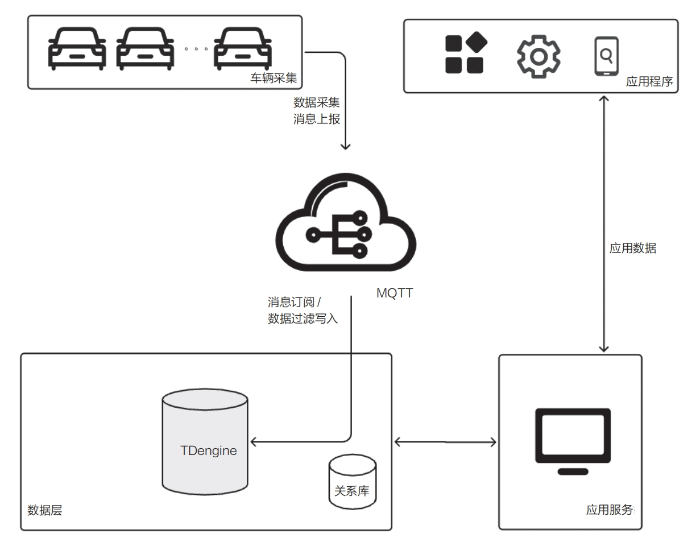
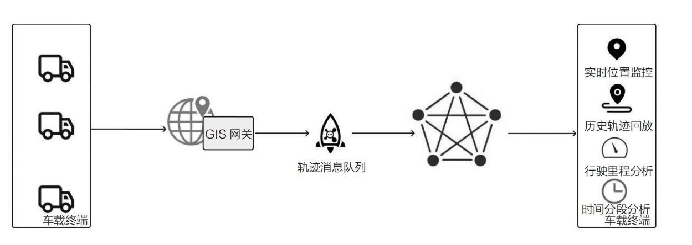

随着科技的迅猛发展和智能设备的广泛普及，车联网技术已逐渐成为现代交通领域的核心要素。在这样的背景下，选择一个合适的车联网时序数据库显得尤为关键。车联网时序数据库不仅仅是数据存储的解决方案，更是一个集车辆信息交互、深度分析和数据挖掘于一体的综合性平台。它能够实时地采集、处理并存储大量的车辆数据，涵盖车辆定位、行驶速度、燃油消耗、故障诊断等多个维度，从而为车辆的高效管理和性能优化提供坚实的数据支撑。

## 车联网面临的挑战

在国家政策的有力引导下，车联网行业正迎来前所未有的发展机遇。早在 2016 年，我国便推出了 GB/T 32960 标准规范，以推动车联网应用的快速发展。自 2017 年起，一系列车联网相关政策相继出台，旨在促进网联化、智能化、共享化和电动化的实现。在这一进程中，车联网车与一切技术扮演着举足轻重的角色，其收集的信息中时序数据占据了绝大多数。随着联网汽车数量的持续增长，如何高效地上传、存储和处理海量数据，以及如何有效应对乱序数据的挑战，进行高效的查询和分析，已成为业界亟须解决的关键问题。

- 海量数据采集：如今，无论是小型客车还是受监管的货车，普遍配备了 T-Box 或其他 OBD（On-Board Diagnostics，车载自动诊断系统）车载终端设备，用于实时采集车辆的运行参数，并将这些数据及时传输至云端数据中心。以某品牌汽车为例，每辆车每秒可采集 140 个高频测点数据，每 30s 采集 280 个低频测点数据。在日常运营中，80 万辆在线车辆每天产生的数据量高达 4.5TB，这些数据最终汇入时序数据库，形成了庞大的数据采集点网络。
- 海量数据存储：鉴于数据采集的规模之大，相应的硬件资源需求自然引起了汽车制造商的高度关注。因此，在选择数据存储方案时，必须考虑高压缩率，最大限度地减少存储空间的占用。同时，应实现冷热数据的自动分离，确保热数据被自动存储到高性能的硬盘上，而冷数据则被转移到较低性能的硬盘上。这样既能保障查询性能不受影响，又能有效降低存储成本，实现资源的合理利用。
- 支持乱序写入整理：在信号不佳或无信号的区域，数据通常会在本地缓存。一旦网络通信恢复正常，依照 GB/T 32960 的规定，数据将以交替发送的方式上传至数据中心，确保实时与离线数据的同步传输。在消息分发至不同区域后，消费组的消费顺序也会导致数据的乱序写入。这种乱序写入若频繁发生，将导致大量存储碎片的产生，进而降低时序数据库的存储效率和查询速度。
- 强大的查询和分析能力：系统应能支持使用标准 SQL 进行状态、时长、位置等关键指标的统计分析。此外，还应具备轨迹历史回放、双轨合验、预警报警等实用功能，以降低学习和分析的难度。对于更复杂的分析需求，系统须支持 UDF，通过编写高级编程语言生成的库文件并加载至集群中，以弥补时序数据库内置函数的局限性。系统应查询操作简便且结果实时性强，以便为业务决策提供有力且及时的数据支持。

## TDengine TSDB 在车联网中的核心价值

在面对亿万级别的点位信息时，任何微小的数据处理逻辑错误或冗余都可能导致性能瓶颈。得益于全球社区爱好者的共同努力、超过 53 万个的装机实例部署，以及在极端条件下的严格验证，TDengine TSDB 在功能和性能方面均达到顶尖水平。在车联网领域，TDengine TSDB 的核心价值体现在以下几个方面。

- 便于采集：作为物联网的一个分支，车联网的技术特点与之一致。TDengine TSDB 配备了可视化采集界面，用户无须编写代码即可轻松将 Kafka、MQTT 等通用消息中间件中的数据导入数据库。此外，提供的可视化性能指标看板大大简化了数据接入和管理的工作流程。
- 数据存储：车联网数据具有高度的相关性，例如特定车型的配置信息或同一车辆上不同点位的状态数据。TDengine TSDB 的设计理念完美契合车联网的需求，采用“一车一表”的模式，简化了数据存储管理的复杂性。结合云原生架构、冷热数据分离、列式存储以及动态扩容（包括横向、纵向扩容和动态添加存储空间）等技术，TDengine TSDB 在数据存储的性能和成本控制方面表现出色。
- 查询分析：TDengine TSDB 作为一个开放且简洁的时序大数据平台，提供了丰富的 API，兼容各种分析工具、编程语言和 BI 系统，如 Matlab、R、永洪 BI 等。TDengine TSDB 主要采用 SQL，易于学习和使用，支持状态、计数、时间、事件及会话窗口等多种分析模式，并内置了 70 多个基础算子，足以应对日常的分析需求。对于更专业的算法分析，用户可通过 C 或 Python 语言开发 UDF，并将其集成到 TDengine TSDB 中。

## TDengine TSDB 在车联网中的应用

车联网场景是时序数据应用的典型代表，而 TDengine TSDB 正是处理这类海量时序数据的理想选择。通过整合车载数据，车联网系统能够实现对汽车各个零部件健康状况的监控、用户驾驶行为的追踪、车载系统的安全分析、合规性检查以及车载网络质量的监测。此外，利用 TDengine TSDB 提供的 geometry 数据类型及其相关函数，车联网系统能够轻松且高效地执行车辆轨迹监管、历史轨迹回放、最新位置定位等关键功能。

### TSP 车联网

汽车制造商通过车载 T-Box 终端收集车辆的关键行驶数据，包括行驶速度、行驶方向、电门开度、制动踏板开度、挡位、电机转速以及电池包信息等。这些数据通过 MQTT 协议汇聚至 TDengine TSDB 进行存储，从而满足车辆历史轨迹的回放需求以及对车辆实时状态的监控。TSP 车联网架构如下图所示。

TDengine TSDB 能够无缝地从外部消息队列（如 MQTT、Kafka）中采集并过滤数据，用户可通过直观的可视化界面来管理和配置采集任务，实现无须编写代码即可接入外部数据源。此外，TDengine TSDB 还支持对接入消息的解析、过滤和映射操作，并提供数据采集任务状态的实时监控功能，从而极大地提高数据接入的工作效率。

在本案例中，系统采用了“一车一表”的建模策略，确保每张子表中的数据都能按照时间顺序进行追加操作。设备表与表之间保持相对独立，并且数据是连续写入的，这一设计显著提高了数据的写入效率。
- 海量高频数据采集上报存储：为了应对海量且高频的数据采集与上报需求，系统采用多节点的三副本或双副本集群架构。每个核心节点能够高效管理并存储高达 100 万张子表。通过分布式部署、构建高可用集群以及实施负载均衡技术，系统确保了数据采集存储在性能、可用性和可靠性方面的卓越表现。
- 采用多级存储方式：系统支持冷热数据分离的策略，将热数据存储于高性能的硬盘上，而冷数据则可根据配置迁移至 S3 对象存储服务中，实现存储方式的灵活性。鉴于数据量的庞大，多级存储不仅满足了日常业务需求，还有效降低了存储成本。通过独特的数据存储结构设计，实现了行转列和连续存储，无损压缩率轻松达到 10% 以内，极大地节约了数据存储空间。
- 预统计和缓存：在数据写入存储空间的过程中，系统已经计算并附带了 max、min、avg、count 等预统计结果。这些预计算结果为大多数统计分析提供了基础，使得在数据量庞大时，能够通过统计函数迅速筛选出所需信息。在处理海量数据的并发写入场景时，系统展现出高效的统计报表生成能力和卓越的 SQL 查询效率。此外，系统内置的实时缓存功能能够实现毫秒级的实时数据反馈。
- 在线异步方式数据整理：此过程不会干扰正常的存储和查询服务，而是对乱序数据和因数据删除产生的存储碎片进行整理，有效释放存储空间。
- 系统部署满足分布式、高可用以及负载均衡的需求，其性能、可靠性和稳定性已经过充分验证。
- 极简大数据平台：与传统大数据平台相比，系统将消息队列、流计算、实时缓存、ETL 工具以及数据库本体集成于一体，构建了极为简洁的架构，同时增强了实时性，大幅减少了验证和维护过程中的工作量。

### 物流车联网

物流车辆运营商借助车辆的轨迹监管、异常预警以及历史轨迹回放功能，实现对运营车辆的在线监控、精准轨迹追踪、深入大数据分析及可视化应用等多方面目标。

在这一业务场景中，系统数据建模遵循“一车一表”的原则进行设计。GIS（Geographic Information System，地理信息系统）网关负责收集并汇聚数万台车辆上报的车辆定位和行驶数据。随后，下游服务解析这些报文并将数据推送至消息队列。通过 TDengine TSDB 的数据接入组件，数据经过加载、过滤和转换等一系列处理步骤后，最终存储于 TDengine TSDB 中。这为下游应用程序提供了实时的车辆位置监控和历史轨迹回放等查询分析服务。物流车联网系统的架构如下图所示：

方案特点如下。
- 高性能：该项目服务于一万辆车，数据量呈现快速增长态势，日均写入记录高达约 10 亿条。项目对聚合查询的高效性和存储压缩性能进行了严格的验证，无损压缩率可达 4%。这证明了 TDengine TSDB 在处理大规模数据时的卓越性能。
- 乱序治理：尽管消息队列的使用难以避免乱序问题的出现，尤其是在离线数据补传的场景中，乱序数据往往表现为时间戳早于当前车辆存储记录的时间戳。这种乱序写入会导致大量存储碎片的产生，严重时会影响数据库的性能。TDengine TSDB 巧妙地解决了这一行业难题，支持在线整理乱序写入，确保数据库性能不受影响。同时，对于异常数据段的删除，也可以通过在线整理实现真正的数据存储空间释放，而不仅仅是索引屏蔽。
- 数据应用：鉴于车辆运营涉及食品安全的特殊性，实时监控当前车辆位置信息显得尤为重要。TDengine TSDB 具备缓存实时数据的功能，无论数据库中已存储多少数据，仍能保持稳定的性能，毫秒级响应最新数据请求，充分发挥时序数据库的实时特性。业务中还需要进行历史轨迹回放、行驶里程分析、时间分段分析等多项操作，TDengine TSDB 的强大性能和多功能性为业务分析提供了无限可能。