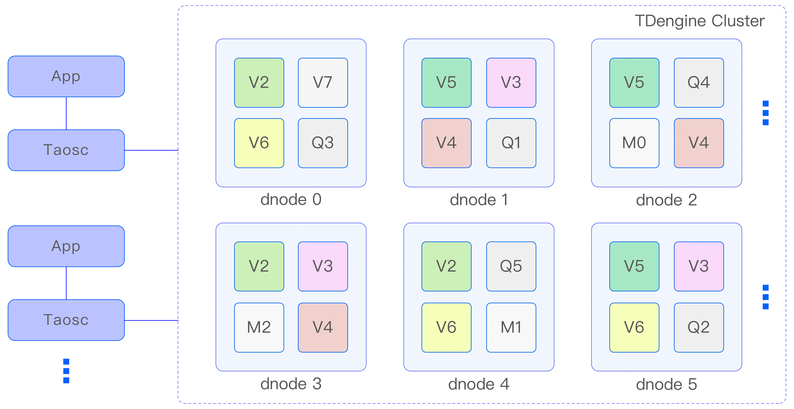
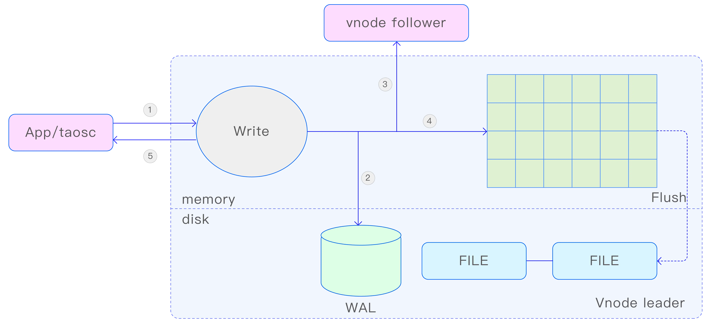

## 集群与基本逻辑单元

TDengine TSDB 的设计是基于单个硬件、软件系统不可靠，基于任何单台计算机都无法提供足够计算能力和存储能力处理海量数据的假设进行设计的。因此 TDengine TSDB 从研发的第一天起，就按照分布式高可靠架构进行设计，是支持水平扩展的，这样任何单台或多台服务器发生硬件故障或软件错误都不影响系统的可用性和可靠性。同时，通过节点虚拟化并辅以负载均衡技术，TDengine TSDB 能最高效率地利用异构集群中的计算和存储资源降低硬件投资。

### 主要逻辑单元

TDengine TSDB 分布式架构的逻辑结构图如下：



<center> 图 1 TDengine TSDB 架构示意图  </center>

一个完整的 TDengine TSDB 系统是运行在一到多个物理节点上的，逻辑上，它包含数据节点（dnode）、TDengine TSDB 应用驱动（taosc）以及应用（app）。系统中存在一到多个数据节点，这些数据节点组成一个集群（cluster）。应用通过 taosc 的 API 与 TDengine TSDB 集群进行互动。下面对每个逻辑单元进行简要介绍。

**物理节点（pnode）：** 
pnode 是一独立运行、拥有自己的计算、存储和网络能力的计算机，可以是安装有 OS 的物理机、虚拟机或 Docker 容器。物理节点由其配置的 FQDN（Fully Qualified Domain Name）来标识。TDengine TSDB 完全依赖 FQDN 来进行网络通讯。

**数据节点（dnode）：** 
dnode 是 TDengine TSDB 服务器侧执行代码 taosd 在物理节点上的一个运行实例。在一个 TDengine TSDB 系统中，至少需要一个 dnode 来确保系统的正常运行。每个 dnode 包含零到多个逻辑的虚拟节点（vnode），但管理节点、弹性计算节点和流计算节点各有 0 个或 1 个逻辑实例。

dnode 在 TDengine TSDB 集群中的唯一标识由其实例的 endpoint（EP）决定。endpoint 是由 dnode 所在物理节点的 FQDN 和配置的网络端口组合而成。通过配置不同的端口，一个 pnode（无论是物理机、虚拟机还是 Docker 容器）可以运行多个实例，即拥有多个 dnode。

**虚拟节点（vnode）：** 
为了更好地支持数据分片、负载均衡以及防止数据过热或倾斜，TDengine TSDB 引入了 vnode（虚拟节点）的概念。虚拟节点被虚拟化为多个独立的 vnode 实例（如上面架构图中的 V2、V3、V4 等），每个 vnode 都是一个相对独立的工作单元，负责存储和管理一部分时序数据。

每个 vnode 都拥有独立的运行线程、内存空间和持久化存储路径，确保数据的隔离性和高效访问。一个 vnode 可以包含多张表（即数据采集点），这些表在物理上分布在不
同的 vnode 上，以实现数据的均匀分布和负载均衡。

当在集群中创建一个新的数据库时，系统会自动为该数据库创建相应的 vnode。一个 dnode 上能够创建的 vnode 数量取决于该 dnode 所在物理节点的硬件资源，如 CPU、内存和存储容量等。需要注意的是，一个 vnode 只能属于一个数据库，但一个数据库可以包含多个 vnode。

除了存储时序数据以外，每个 vnode 还保存了其包含的表的 schema 信息和标签值等元数据。这些信息对于数据的查询和管理至关重要。

在集群内部，一个 vnode 由其所归属的 dnode 的 endpoint 和所属的 vgroup ID 唯一标识。管理节点负责创建和管理这些 vnode，确保它们能够正常运行并协同工作。

**管理节点（mnode）：** 
mnode（管理节点）是 TDengine TSDB 集群中的核心逻辑单元，负责监控和维护所有 dnode 的运行状态，并在节点之间实现负载均衡（如图 1 中的 M1、M2、M3 所示）。作为元数据（包括用户、数据库、超级表等）的存储和管理中心，mnode 也被称为 MetaNode。

为了提高集群的高可用性和可靠性，TDengine TSDB 集群允许有多个（最多不超过 3 个）mnode。这些 mnode 自动组成一个虚拟的 mnode 组，共同承担管理职责。mnode 支持多副本，并采用 Raft 一致性协议来确保数据的一致性和操作的可靠性。在 mnode 集群中，任何数据更新操作都必须在 leader 节点上执行。

mnode 集群的第 1 个节点在集群部署时自动创建，而其他节点的创建和删除则由用户通过 SQL 手动完成。每个 dnode 上最多有一个 mnode，并由其所归属的 dnode 的 endpoint 唯一标识。

为了实现集群内部的信息共享和通信，每个 dnode 通过内部消息交互机制自动获取整个集群中所有 mnode 所在的 dnode 的 endpoint。

**计算节点（qnode）：** 
qnode（计算节点）是 TDengine TSDB 集群中负责执行查询计算任务的虚拟逻辑单元，同时也处理基于系统表的 show 命令。为了提高查询性能和并行处理能力，集群中可以配置多个 qnode，这些 qnode 在整个集群范围内共享使用（如图 1 中的 Q1、Q2、Q3 所示）。

与 dnode 不同，qnode 并不与特定的数据库绑定，这意味着一个 qnode 可以同时处理来自多个数据库的查询任务。每个 dnode 上最多有一个 qnode，并由其所归属的 dnode 的 endpoint 唯一标识。

当客户端发起查询请求时，首先与 mnode 交互以获取当前可用的 qnode 列表。如果在集群中没有可用的 qnode，计算任务将在 vnode 中执行。当执行查询时，调度器会根据执行计划分配一个或多个 qnode 来共同完成任务。qnode 能够从 vnode 获取所需的数据，并将计算结果发送给其他 qnode 进行进一步处理。

通过引入独立的 qnode，TDengine TSDB 实现了存储和计算的分离。

**流计算节点（snode）：** 
snode（流计算节点）是 TDengine TSDB 集群中专门负责处理流计算任务的虚拟逻辑单元（如上架构图 中的 S1、S2、S3 所示）。为了满足实时数据处理的需求，集群中可以配置多个 snode，这些 snode 在整个集群范围内共享使用。

与 dnode 类似，snode 并不与特定的流绑定，这意味着一个 snode 可以同时处理多个流的计算任务。每个 dnode 上最多有一个 snode，并由其所归属的 dnode 的 endpoint 唯一标识。

当需要执行流计算任务时，mnode 会调度可用的 snode 来完成这些任务。如果在集群中没有可用的 snode，流计算任务将在 vnode 中执行。

通过将流计算任务集中在 snode 中处理，TDengine TSDB 实现了流计算与批量计算的分离，从而提高了系统对实时数据的处理能力。

**虚拟节点组（VGroup）：** 

vgroup（虚拟节点组）是由不同 dnode 上的 vnode 组成的一个逻辑单元。这些 vnode 之间采用 Raft 一致性协议，确保集群的高可用性和高可靠性。在 vgroup 中，写操作只能在 leader vnode 上执行，而数据则以异步复制的方式同步到其他 follower vnode，从而在多个物理节点上保留数据副本。

vgroup 中的 vnode 数量决定了数据的副本数。要创建一个副本数为 N 的数据库，集群必须至少包含 N 个 dnode。副本数可以在创建数据库时通过参数 replica 指定，默认值为 1。利用 TDengine TSDB 的多副本特性，企业可以摒弃昂贵的硬盘阵列等传统存储设备，依然实现数据的高可靠性。

vgroup 由 mnode 负责创建和管理，并为其分配一个集群唯一的 ID，即 vgroup ID。如果两个 vnode 的 vgroup ID 相同，则说明它们属于同一组，数据互为备份。值得注意的是，vgroup 中的 vnode 数量可以动态调整，但 vgroup ID 始终保持不变，即使 vgroup 被删除，其 ID 也不会被回收和重复利用。

通过这种设计，TDengine TSDB 在保证数据安全性的同时，实现了灵活的副本管理和动态扩展能力

**Taosc** 

taosc（应用驱动）是 TDengine TSDB 为应用程序提供的驱动程序，负责处理应用程序与集群之间的接口交互。taosc 提供了 C/C++ 语言的原生接口，并被内嵌于 JDBC、C#、Python、Go、Node.js 等多种编程语言的连接库中，从而支持这些编程语言与数据库交互。

应用程序通过 taosc 而非直接连接集群中的 dnode 与整个集群进行通信。taosc 负责获取并缓存元数据，将写入、查询等请求转发到正确的 dnode，并在将结果返回给应用程序之前，执行最后一级的聚合、排序、过滤等操作。对于 JDBC、C/C++、C#、Python、Go、Node.js 等接口，taosc 是在应用程序所处的物理节点上运行的。

此外，taosc 还可以与 taosAdapter 交互，支持全分布式的 RESTful 接口。这种设计使得 TDengine TSDB 能够以统一的方式支持多种编程语言和接口，同时保持高性能和可扩展性。

### 节点之间的通信

**通信方式：**

TDengine TSDB 集群内部的各个 dnode 之间以及应用驱动程序与各个 dnode 之间的通信均通过 TCP 方式实现。这种通信方式确保了数据传输的稳定性和可靠性。

为了优化网络传输性能并保障数据安全，TDengine TSDB 会根据配置自动对传输的数据进行压缩和解压缩处理，以减少网络带宽的占用。同时，TDengine TSDB 还支持数字签名和认证机制，确保数据在传输过程中的完整性和机密性得到保障。

**FQDN 配置：**

在 TDengine TSDB 集群中，每个 dnode 可以拥有一个或多个 FQDN。为了指定 dnode 的 FQDN，可以在配置文件 taos.cfg 中使用 fqdn 参数进行配置。如果没有明确指定，dnode 将自动获取其所在计算机的 hostname 并作为默认的 FQDN。

虽然理论上可以将 taos.cfg 中的 FQDN 参数设置为 IP 地址，但官方并不推荐这种做法。因为 IP 地址可能会随着网络环境的变化而变化，这可能导致集群无法正常工作。当使用 FQDN 时，需要确保 DNS 服务能够正常工作，或者在节点和应用程序所在的节点上正确配置 hosts 文件，以便解析 FQDN 到对应的 IP 地址。此外，为了保持良好的兼容性和可移植性，fqdn 参数值的长度应控制在 96 个字符以内。

**端口配置：**

在 TDengine TSDB 集群中，每个 dnode 对外提供服务时使用的端口由配置参数 serverPort 决定。默认情况下，该参数的值为 6030。通过调整 serverPort 参数，可以灵活地配置 dnode 的对外服务端口，以满足不同部署环境和安全策略的需求。

**集群对外连接：**

TDengine TSDB 集群可以容纳单个、多个甚至几千个数据节点。应用只需要向集群中任何一个数据节点发起连接即可。这种设计简化了应用程序与集群之间的交互过程，提高了系统的可扩展性和易用性。 

当使用 TDengine TSDB CLI 启动 taos 时，可以通过以下选项来指定 dnode 的连接信息。
- -h：用于指定 dnode 的 FQDN。这是一个必需项，用于告知应用程序连接到哪个 dnode。
- -P：用于指定 dnode 的端口。这是一个可选项，如果不指定，将使用 TDengine TSDB 的配置参数 serverPort 作为默认值。

通过这种方式，应用程序可以灵活地连接到集群中的任意 dnode，而无须关心集群的具体拓扑结构。

**集群内部通讯：**

在 TDengine TSDB 集群中，各个 dnode 之间通过 TCP 方式进行通信。当一个 dnode 启动时，它会首先获取 mnode 所在 dnode 的 endpoint 信息。其次，新启动的 dnode 与集群中的 mnode 建立连接，并进行信息交换。

这一过程确保了 dnode 能够及时加入集群，并与 mnode 保持同步，从而能够接收和执行集群层面的命令和任务。通过 TCP 连接，dnode 之间以及 dnode 与 mnode 之间能够可靠地传输数据，保障集群的稳定运行和高效的数据处理能力。

获取 mnode 的 endpoint 信息的步骤如下：
- 第 1 步：检查自己的 dnode.json 文件是否存在，如果不存在或不能正常打开以获得 mnode endpoint 信息，进入第 2 步。
- 第 2 步，检查配置文件 taos.cfg，获取节点配置参数 firstEp、secondEp（这两个参数指定的节点可以是不带 mnode 的普通节点，这样的话，节点被连接时会尝试重定向到 mnode 节点），如果不存在 firstEP、secondEP，或者 taos.cfg 中没有这两个配置参数，或者参数无效，进入第 3 步。
- 第 3 步，将自己的 endpoint 设为 mnode endpoint，并独立运行。

获取 mnode 的 endpoint 列表后，dnode 发起连接，如果连接成功，则成功加入工作的集群；如果不成功，则尝试 mnode endpoint 列表中的下一个。如果都尝试了，但仍然连接失败，则休眠几秒后再次尝试。

**Mnode 的选择：**

在 TDengine TSDB 集群中，mnode 是一个逻辑上的概念，它并不对应于一个单独执行代码的实体。实际上，mnode 的功能由服务器侧的 taosd 进程负责管理。

在集群部署阶段，第 1 个 dnode 会自动承担 mnode 的角色。随后，用户可以通过 SQL 在集群中创建或删除额外的 mnode，以满足集群管理的需求。这种设计使得 mnode 的数量和配置具有很高的灵活性，可以根据实际应用场景进行调整。

**新数据节点的加入：**

一旦 TDengine TSDB 集群中有一个 dnode 启动并运行，该集群便具备了基本的工作能力。为了扩展集群的规模，可以按照以下两个步骤添加新节点。
- 第 1 步，首先使用 TDengine TSDB CLI 连接现有的 dnode。其次，执行 create dnode 命令来 添加新的 dnode。这个过程将引导用户完成新 dnode 的配置和注册过程 - 。
- 第 2 步，在新加入的 dnode 的配置文件 taos.cfg 中设置 firstEp 和 secondEp 参数。这两个参数应分别指向现有集群中任意两个活跃 dnode 的 endpoint。这样做可以确保新 dnode 能够正确加入集群，并与现有节点进行通信。

**重定向：**

在 TDengine TSDB 集群中，无论是新启动的 dnode 还是 taosc，它们首先需要与集群中的 mnode 建立连接。然而，用户通常并不知道哪个 dnode 正在运行 mnode。为了解决这个问题，TDengine TSDB 采用了一种巧妙的机制来确保它们之间的正确连接。

具体来说，TDengine TSDB 不要求 dnode 或 taosc 直接连接到特定的 mnode。相反，它们只需要向集群中的任何一个正在工作的 dnode 发起连接。由于每个活跃的 dnode 都维护着当前运行的 mnode endpoint 列表，因此这个连接请求会被转发到适当的 mnode。

当接收到来自新启动的 dnode 或 taosc 的连接请求时，如果当前 dnode 不是 mnode，它会立即将 mnode endpoint 列表回复给请求方。收到这个列表后，taosc 或新启动的 dnode 可以根据这个列表重新尝试建立与 mnode 的连接。

此外，为了确保集群中的所有节点都能及时获取最新的 mnode endpoint 列表，TDengine TSDB 采用了节点间的消息交互机制。当 mnode endpoint 列表发生变化时，相关的更新会通过消息迅速传播到各个 dnode，进而通知到 taosc。

### 一个典型的消息流程

为解释 vnode、mnode、taosc 和应用之间的关系以及各自扮演的角色，下面对写入数据这个典型操作的流程进行剖析。


<center> 图 2 TDengine TSDB 典型的操作流程 </center>

- 第 1 步：应用通过 JDBC 或其他 API 接口发起插入数据的请求。
- 第 2 步：taosc 会检查缓存，看是否保存有该表所在数据库的 vgroup-info 信息。如果有，直接到第 4 步。如果没有，taosc 将向 mnode 发出 get vgroup-info 请求。
- 第 4 步：mnode 将该表所在数据库的 vgroup-info 返回给 taosc。Vgroup-info 包含数据库的 vgroup 分布信息（vnode ID 以及所在的 dnode 的 End Point，如果副本数为 N，就有 N 组 End Point），还包含每个 vgroup 中存储数据表的 hash 范围。如果 taosc 迟迟得不到 mnode 回应，而且存在多个 mnode，taosc 将向下一个 mnode 发出请求。
- 第 4 步：taosc 会继续检查缓存，看是否保存有该表的 meta-data。如果有，直接到第 6 步。如果没有，taosc 将向 vnode 发出 get meta-data 请求。
- 第 5 步：vnode 将该表的 meta-data 返回给 taosc。Meta-data 包含有该表的 schema。
- 第 6 步：taosc 向 leader vnode 发起插入请求。
- 第 7 步：vnode 插入数据后，给 taosc 一个应答，表示插入成功。如果 taosc 迟迟得不到 vnode 的回应，taosc 会认为该节点已经离线。这种情况下，如果被插入的数据库有多个副本，taosc 将向 vgroup 里下一个 vnode 发出插入请求。
- 第 8 步：taosc 通知 APP，写入成功。

对于第二步，taosc 启动时，并不知道 mnode 的 End Point，因此会直接向配置的集群对外服务的 End Point 发起请求。如果接收到该请求的 dnode 并没有配置 mnode，该 dnode 会在回复的消息中告知 mnode EP 列表，这样 taosc 会重新向新的 mnode 的 EP 发出获取 meta-data 的请求。

对于第四和第六步，没有缓存的情况下，taosc 无法知道虚拟节点组里谁是 leader，就假设第一个 vnodeID 就是 leader，向它发出请求。如果接收到请求的 vnode 并不是 leader，它会在回复中告知谁是 leader，这样 taosc 就向建议的 leader vnode 发出请求。一旦得到插入成功的回复，taosc 会缓存 leader 节点的信息。

上述是插入数据的流程，查询、计算的流程也完全一致。taosc 把这些复杂的流程全部封装屏蔽了，对于应用来说无感知也无需任何特别处理。

通过 taosc 缓存机制，只有在第一次对一张表操作时，才需要访问 mnode，因此 mnode 不会成为系统瓶颈。但因为 schema 有可能变化，而且 vgroup 有可能发生改变（比如负载均衡发生），因此 taosc 会定时和 mnode 交互，自动更新缓存。

## 存储模型与数据分区、分片

### 存储模型

TDengine TSDB 存储的数据包括采集的时序数据以及库、表相关的元数据、标签数据等，这些数据具体分为三部分：

- 时序数据：时序数据是 TDengine TSDB 的核心存储对象，它们被存储在 vnode 中。时序数据由 data、head、sma 和 stt 4 类文件组成，这些文件共同构成了时序数据的完整存储结构。由于时序数据的特点是数据量大且查询需求取决于具体应用场景，因此 TDengine TSDB 采用了“一个数据采集点一张表”的模型来优化存储和查询性能。在这种模型下，一个时间段内的数据是连续存储的，对单张表的写入是简单的追加操作，一次读取可以获取多条记录。这种设计确保了单个数据采集点的写入和查询操作都能达到最优性能。
- 数据表元数据：包含标签信息和 Table Schema 信息，存放于 vnode 里的 meta 文件，支持增删改查四个标准操作。数据量很大，有 N 张表，就有 N 条记录，因此采用 LRU 存储，支持标签数据的索引。TDengine TSDB 支持多核多线程并发查询。只要计算内存足够，元数据全内存存储，千万级别规模的标签数据过滤结果能毫秒级返回。在内存资源不足的情况下，仍然可以支持数千万张表的快速查询。
- 数据库元数据：存放于 mnode 里，包含系统节点、用户、DB、STable Schema 等信息，支持增删改查四个标准操作。这部分数据的量不大，可以全内存保存，而且由于客户端有缓存，查询量也不大。因此目前的设计虽是集中式存储管理，但不会构成性能瓶颈。

与传统的 NoSQL 存储模型相比，TDengine TSDB 将标签数据与时序数据完全分离存储，它具有两大优势：

- 显著降低标签数据存储的冗余度。在常见的 NoSQL 数据库或时序数据库中，通常采用 Key-Value 存储模型，其中 Key 包含时间戳、设备 ID 以及各种标签。这导致每条记录都携带大量重复的标签信息，从而浪费宝贵的存储空间。此外，如果应用程序需要在历史数据上增加、修改或删除标签，就必须遍历整个数据集并重新写入，这样的操作成本极高。相比之下，TDengine TSDB 通过将标签数据与时序数据分离存储，有效避免了这些问题，大大减少了存储空间的浪费，并降低了标签数据操作的成本。
- 实现极为高效的多表之间的聚合查询。在进行多表之间的聚合查询时，TDengine TSDB 首先根据标签过滤条件找出符合条件的表，然后查找这些表对应的数据块。这种方法显著减少了需要扫描的数据集大小，从而大幅提高了查询效率。这种优化策略使得 TDengine TSDB 能够在处理大规模时序数据时保持高效的查询性能，满足各种复杂场景下的数据分析需求。

### 数据分片

在进行海量数据管理时，为了实现水平扩展，通常需要采用数据分片（sharding）和数据分区（partitioning）策略。TDengine TSDB 通过 vnode 来实现数据分片，并通过按时间段划分数据文件来实现时序数据的分区。

vnode 不仅负责处理时序数据的写入、查询和计算任务，还承担着负载均衡、数据恢复以及支持异构环境的重要角色。为了实现这些目标，TDengine TSDB 将一个 dnode 根据其计算和存储资源切分为多个 vnode。这些 vnode 的管理过程对应用程序是完全透明的，由 TDengine TSDB 自动完成。

对于单个数据采集点，无论其数据量有多大，一个 vnode 都拥有足够的计算资源和存储资源来应对（例如，如果每秒生成一条 16B 的记录，一年产生的原始数据量也不到 0.5GB）。因此，TDengine TSDB 将一张表（即一个数据采集点）的所有数据都存储在一个 vnode 中，避免将同一数据采集点的数据分散到两个或多个 dnode 上。同时，一个 vnode 可以存储多个数据采集点（表）的数据，最大可容纳的表数目上限为 100 万。设计上，一个 vnode 中的所有表都属于同一个数据库。

TDengine TSDB 3.0 采用一致性哈希算法来确定每张数据表所在的 vnode。在创建数据库时，集群会立即分配指定数量的 vnode，并确定每个 vnode 负责的数据表范围。当创建一张表时，集群会根据数据表名计算出其所在的 vnode ID，并在该 vnode 上创建表。如果数据库有多个副本，TDengine TSDB 集群会创建一个 vgroup，而不是仅创建一个 vnode。集群对 vnode 的数量没有限制，仅受限于物理节点本身的计算和存储资源。

每张表的元数据（包括 schema、标签等）也存储在 vnode 中，而不是集中存储在 mnode 上。这种设计实际上是对元数据的分片，有助于高效并行地进行标签过滤操作，进一步提高查询性能。

### 数据分区

除了通过 vnode 进行数据分片以外，TDengine TSDB 还采用按时间段对时序数据进行分区的策略。每个数据文件仅包含一个特定时间段的时序数据，而时间段的长度由数据库参数 duration 决定。这种按时间段分区的做法不仅简化了数据管理，还便于高效实施数据的保留策略。一旦数据文件超过了规定的天数（由数据库参数 keep 指定），系统将自动删除这些过期的数据文件。

此外，TDengine TSDB 还支持将不同时间段的数据存储在不同的路径和存储介质中。这种灵活性使得大数据的冷热管理变得简单易行，用户可以根据实际需求实现多级存储，从而优化存储成本和访问性能。

综合来看，TDengine TSDB 通过 vnode 和时间两个维度对大数据进行精细切分，实现了高效并行管理和水平扩展。这种设计不仅提高了数据处理的速度和效率，还为用户提供了灵活、可扩展的数据存储和查询解决方案，满足了不同规模和需求的场景应用。

### 负载均衡与扩容

每个 dnode 都会定期向 mnode 报告其当前状态，包括硬盘空间使用情况、内存大小、CPU 利用率、网络状况以及 vnode 的数量等关键指标。这些信息对于集群的健康监控和资源调度至关重要。

关于负载均衡的触发时机，目前 TDengine TSDB 允许用户手动指定。当新的 dnode 被添加到集群中时，用户需要手动启动负载均衡流程，以确保集群在最佳状态下运行。

随着时间的推移，集群中的数据分布可能会发生变化，导致某些 vnode 成为数据热点。为了应对这种情况，TDengine TSDB 采用基于 Raft 协议的副本调整和数据拆分算法，实现了数据的动态扩容和再分配。这一过程可以在集群运行时无缝进行，不会影响数据的写入和查询服务，从而确保了系统的稳定性和可用性。

## 数据写入与复制流程

在一个具有 N 个副本的数据库中，相应的 vgroup 将包含 N 个编号相同的 vnode。在这些 vnode 中，只有一个被指定为 leader，其余的都充当 follower 的角色。这种主从架构确保了数据的一致性和可靠性。

当应用程序尝试将新记录写入集群时，只有 leader vnode 能够接受写入请求。如果 follower vnode 意外地收到写入请求，集群会立即通知 taosc 需要重新定向到 leader vnode。这一措施确保所有的写入操作都发生在正确的 leader vnode 上，从而维护数据的一致性和完整性。

通过这种设计，TDengine TSDB 确保了在分布式环境下数据的可靠性和一致性，同时提供高效的读写性能。

### Leader Vnode 写入流程

Leader Vnode 遵循下面的写入流程：



<center> 图 3 TDengine TSDB Leader 写入流程  </center>

- 第 1 步：leader vnode 收到应用的写入数据请求，验证 OK，验证有效性后进入第 2 步；
- 第 2 步：vnode 将该请求的原始数据包写入数据库日志文件 WAL。如果 `wal_level` 设置为 2，而且 `wal_fsync_period` 设置为 0，TDengine TSDB 还将 WAL 数据立即落盘，以保证即使宕机，也能从数据库日志文件中恢复数据，避免数据的丢失；
- 第 3 步：如果有多个副本，vnode 将把数据包转发给同一虚拟节点组内的 follower vnodes，该转发包带有数据的版本号（version）；
- 第 4 步：写入内存，并将记录加入到 skip list。但如果未达成一致，会触发回滚操作；
- 第 5 步：leader vnode 返回确认信息给应用，表示写入成功；
- 第 6 步：如果第 2、3、4 步中任何一步失败，将直接返回错误给应用；

### Follower Vnode 写入流程

对于 follower vnode，写入流程是：


<center> 图 4 TDengine TSDB Follower 写入流程  </center>

- 第 1 步：follower vnode 收到 leader vnode 转发了的数据插入请求。
- 第 2 步：vnode 将把该请求的原始数据包写入数据库日志文件 WAL。如果 `wal_level` 设置为 2，而且 `wal_fsync_period` 设置为 0，TDengine TSDB 还将 WAL 数据立即落盘，以保证即使宕机，也能从数据库日志文件中恢复数据，避免数据的丢失。
- 第 3 步：写入内存，更新内存中的 skip list。

与 leader vnode 相比，follower vnode 不存在转发环节，也不存在回复确认环节，少了两步。但写内存与 WAL 是完全一样的。

### 主从选择

每个 vnode 都维护一个数据的版本号，该版本号在 vnode 对内存中的数据进行持久化存储时也会被一并持久化。每次更新数据时，无论是时序数据还是元数据，都会使版本号递增，确保数据的每次修改都被准确记录。

当 vnode 启动时，它的角色（leader 或 follower）是不确定的，且数据处于未同步状态。为了确定自己的角色并同步数据，vnode 需要与同一 vgroup 内的其他节点建立 TCP 连接。在连接建立后，vnode 之间会互相交换版本号、任期等关键信息。基于这些信息，vnode 将使用标准的 Raft 一致性算法完成选主过程，从而确定谁是 leader，谁应该作为 follower。

这一机制确保在分布式环境下，vnode 之间能够有效地协调一致，维护数据的一致性和系统的稳定性

### 同步复制

在 TDengine TSDB 中，每次 leader vnode 接收到写入数据请求并将其转发给其他副本时，它并不会立即通知应用程序写入成功。相反，leader vnode 需要等待超过半数的副本（包括自身）达成一致意见后，才会向应用程序确认写入操作已成功。如果在规定的时间内未能获得半数以上副本的确认，leader vnode 将返回错误信息给应用程序，表明写入数据操作失败。

这种同步复制的机制确保了数据在多个副本之间的一致性和安全性，但同时也带来了写入性能方面的挑战。为了平衡数据一致性和性能需求，TDengine TSDB 在同步复制过程中引入了流水线复制算法。

流水线复制算法允许不同数据库连接的写入数据请求确认过程同时进行，而不是顺序等待。这样，即使某个副本的确认延迟，也不会影响到其他副本的写入操作。通过这种方式，TDengine TSDB 在保证数据一致性的同时，显著提升了写入性能，满足了高吞吐量和低延迟的数据处理需求。

### 成员变更

在数据扩容、节点迁移等场景中，需要对 vgroup 的副本数目进行调整。在这些情况下，存量数据的多少直接影响到副本之间数据复制的所需时间，过多的数据复制可能会
严重阻塞数据的读写过程。

为了解决这一问题，TDengine TSDB 对 Raft 协议进行了扩展，引入了 learner 角色。learner 角色在复制过程中起到至关重要的作用，但它们不参与投票过程，只负责接收数据的复制。由于 learner 不参与投票，因此在数据写入时，判断写入成功的条件并不包括 learner 的确认。

当 learner 与 leader 之间的数据差异较大时，learner 会采用快照（snapshot）方式进行数据同步。快照同步完成后，learner 会继续追赶 leader 的日志，直至两者数据量接近。一旦 learner 与 leader 的数据量足够接近，learner 便会转变为 follower 角色，开始参与数据写入的投票和选举投票过程。

### 重定向

当 taosc 将新的记录写入 TDengine TSDB 集群时，它首先需要定位到当前的 leader vnode，因为只有 leader vnode 负责处理写入数据请求。如果 taosc 尝试将写入数据请求发送到 follower vnode，集群会立即通知 taosc 需要重新定向到正确的 leader vnode。

为了确保写入数据请求能够正确路由到 leader vnode，taosc 会维护一个关于节点组拓扑的本地缓存。当收到集群的通知后，taosc 会根据最新的节点组拓扑信息，重新计算并确定 leader vnode 的位置，然后将写入数据请求发送给它。同时，taosc 还会更新本地缓存中的 leader 分布信息，以备后续使用。

这种机制确保了应用在通过 taosc 访问 TDengine TSDB 时，无须关心网络重试的问题。无论集群中的节点如何变化，taosc 都能自动处理这些变化，确保写入数据请求始终被正确地路由到 leader vnode

## 缓存与持久化

### 时序数据缓存

TDengine TSDB 采纳了一种独特的时间驱动缓存管理策略，亦称为写驱动缓存管理机制。这一策略与传统的读驱动数据缓存模式有所不同，其核心在于优先将最新写入的数据存储在集群的缓存中。当缓存容量接近阈值时，系统会将最早期的数据进行批量写入硬盘的操作。详细来讲，每个 vnode 都拥有独立的内存空间，这些内存被划分为多个固定大小的内存块，且不同 vnode 之间的内存是完全隔离的。在数据写入过程中，采用的是类似日志记录的顺序追加方式，每个 vnode 还维护有自身的 SkipList 结构，以便于数据的快速检索。一旦超过三分之一的内存块被写满，系统便会启动数据落盘的过程，并将新的写入操作引导至新的内存块。通过这种方式，vnode 中的三分之一内存块得以保留最新的数据，既实现了缓存的目的，又保证了查询的高效性。vnode 的内存大小可以通过数据库参数 buffer 进行配置。

此外，考虑到物联网数据的特点，用户通常最关注的是数据的实时性，即最新产生的数据。TDengine TSDB 很好地利用了这一特点，优先将最新到达的（即当前状态）数据存储在缓存中。具体而言，TDengine TSDB 会将最新到达的数据直接存入缓存，以便快速响应用户对最新一条或多条数据的查询和分析需求，从而在整体上提高数据库查询的响应速度。从这个角度来看，通过合理设置数据库参数，TDengine TSDB 完全可以作为数据缓存来使用，这样就无须再部署 Redis 或其他额外的缓存系统。这种做法不仅有效简化了系统架构，还有助于降低运维成本。需要注意的是，一旦 TDengine TSDB 重启，缓存中的数据将被清除，所有先前缓存的数据都会被批量写入硬盘，而不会像专业的 Key-Value 缓存系统那样自动将之前缓存的数据重新加载回缓存。

### last/last_row 缓存

在时序数据的场景中，查询表的最后一条记录（last_row）或最后一条非 NULL 记录（last）是一个常见的需求。为了提高 TDengine TSDB 对这种查询的响应速度，TSDB 为每张表的 last 和 last_row 数据提供了 LRU 缓存。LRU 缓存采用延迟加载策略，当首次查询某张表的 last 或 last_row 时，缓存模块会去内存池和磁盘文件加载数据，处理后放入 LRU 缓存，并返回给查询模块继续处理；当有新的数据插入或删除时，如果缓存需要更新，会进行相应的更新操作；如果缓存中没有当前被写入表的数据，则直接跳过，无需其它操作。

此外在缓存配置更新的时候，也会更新缓存数据。比如，缓存功能默认是关闭的，用户使用命令开启缓存功能之后，就会在首次查询时加载数据；当关闭缓存开关时，会释放之前的缓存区。当查询某一个子表的 last 或 last_row 数据时，如果缓存中没有，则从内存池和磁盘文件加载对应的 last 或 last_row 数据到缓存中；当查询某一个超级表的 last 或 last_row 数据时，这个超级表对应的所有子表都需要加载到缓存中。

通过数据库参数 cachemodel 可以配置某一个数据库的缓存参数，默认值为 "none"，表示不开启缓存，另外三个值为 "last_row"，"last_value"，"both"；分别是开启 last_row 缓存，开启 last 缓存，和两个同时开启。缓存当前所使用的内存数量，可在通过 show vgroups; 命令，在 cacheload 列中进行查看，单位为字节。

### 持久化存储

TDengine TSDB 采用了一种数据驱动的策略来实现缓存数据的持久化存储。当 vnode 中的缓存数据积累到一定量时，为了避免阻塞后续数据的写入，TDengine TSDB 会启动落盘线程，将这些缓存数据写入持久化存储设备。在此过程中，TDengine TSDB 会创建新的数据库日志文件用于数据落盘，并在落盘成功后删除旧的日志文件，以防止日志文件无限制增长。

为了充分发挥时序数据的特性，TDengine TSDB 将一个 vnode 的数据分割成多个文件，每个文件仅存储固定天数的数据，这个天数由数据库参数 duration 设定。通过这种分文件存储的方式，当查询特定时间段的数据时，无须依赖索引即可迅速确定需要打开哪些数据文件，极大地提高了数据读取的效率。

对于采集的数据，通常会有一定的保留期限，该期限由数据库参数 keep 指定。超出设定天数的数据文件将被集群自动移除，并释放相应的存储空间。

当设置 duration 和 keep 两个参数后，一个处于典型工作状态的 vnode 中，总的数据文件数量应为向上取整 (keep/duration)+1 个。数据文件的总个数应保持在一个合理的范围内，不宜过多也不宜过少，通常介于 10 到 100 之间较为适宜。基于这一原则，可以合理设置 duration 参数。可以调整参数 keep，但参数 duration 一旦设定，则无法更改。

在每个数据文件中，表的数据是以块的形式存储的。一张表可能包含一到多个数据文件块。在一个文件块内，数据采用列式存储，占据连续的存储空间，这有助于显著提高读取度。文件块的大小由数据库参数 maxRows（每块最大记录条数）控制，默认值为 4096。这个值应适中，过大可能导致定位特定时间段数据的搜索时间变长，影响读取速度；过小则可能导致数据文件块的索引过大，压缩效率降低，同样影响读取速度。

每个数据文件块（以 .data 结尾）都配有一个索引文件（以 .head 结尾），该索引文件包含每张表的各个数据文件块的摘要信息，记录了每个数据文件块在数据文件中的偏移量、数据的起始时间和结束时间等信息，以便于快速定位所需数据。此外，每个数据文件块还有一个与之关联的 last 文件（以 .last 结尾），该文件旨在防止数据文件块在落盘时发生碎片化。如果某张表落盘的记录条数未达到数据库参数 minRows（每块最小记录条数）的要求，这些记录将首先存储在 last 文件中，待下次落盘时，新落盘的记录将与 last 文件中的记录合并，然后再写入数据文件块。

在数据写入硬盘的过程中，是否对数据进行压缩取决于数据库参数 comp 的设置。TDengine TSDB 提供了 3 种压缩选项—无压缩、一级压缩和二级压缩，对应的 comp 值分别为 0、1 和 2。一级压缩会根据数据类型采用相应的压缩算法，如 delta-delta 编码、simple8B 编码、zig-zag 编码、LZ4 等。二级压缩则在一级压缩的基础上进一步使用通用压缩算法，以实现更高的压缩率。

### 预计算

为了显著提高查询处理的效率，TDengine TSDB 在数据文件块的头部存储了该数据文件块的统计信息，包括最大值、最小值和数据总和，这些被称为预计算单元。当查询处理涉及这些计算结果时，可以直接利用这些预计算值，而无须访问数据文件块的具体内容。对于那些硬盘 I/O 成为瓶颈的查询场景，利用预计算结果可以有效减轻读取硬盘 I/O 的压力，从而提高查询速度。

除了预计算功能以外，TDengine TSDB 还支持对原始数据进行多种降采样存储。一种降采样存储方式是 Rollup SMA，它能够自动对原始数据进行降采样存储，并支持 3 个不同的数据保存层级，用户可以指定每层数据的聚合周期和保存时长。这对于那些关注数据趋势的场景尤为适用，其核心目的是减少存储开销并提高查询速度。另一种降采样存储方式是 Time-Range-Wise SMA，它可以根据聚合结果进行降采样存储，非常适合于高频的 interval 查询场景。该功能采用与普通流计算相同的逻辑，并允许用户通过设置 watermark 来处理延时数据，相应地，实际的查询结果也会有一定的时间延迟。

### 多级存储与对象存储

说明：多级存储功能仅企业版支持。

在默认配置下，TDengine TSDB 会将所有数据保存在 /var/lib/taos 目录下，而且每个 vnode 的数据文件保存在该目录下的不同目录。为扩大存储空间，尽量减少文件读取的瓶颈，提高数据吞吐率 TDengine TSDB 可通过配置系统参数 dataDir 让多个挂载的硬盘被系统同时使用。

除此之外，TDengine TSDB 也提供了数据分级存储的功能，将不同时间段的数据存储在挂载的不同介质上的目录里，从而实现不同“热度”的数据存储在不同的存储介质上，充分利用存储，节约成本。比如，最新采集的数据需要经常访问，对硬盘的读取性能要求高，那么用户可以配置将这些数据存储在 SSD 盘上。超过一定期限的数据，查询需求量没有那么高，那么可以存储在相对便宜的 HDD 盘上。

多级存储支持 3 级，每级最多可配置 128 个挂载点。

TDengine TSDB 多级存储配置方式如下（在配置文件/etc/taos/taos.cfg 中）：

```
dataDir [path] <level> <primary> <disable_create_new_file>
```

- path: 挂载点的文件夹路径
- level: 介质存储等级，取值为 0，1，2。
  0 级存储最新的数据，1 级存储次新的数据，2 级存储最老的数据，省略默认为 0。
  各级存储之间的数据流向：0 级存储 -> 1 级存储 -> 2 级存储。
  同一存储等级可挂载多个硬盘，同一存储等级上的数据文件分布在该存储等级的所有硬盘上。
  需要说明的是，数据在不同级别的存储介质上的移动，是由系统自动完成的，用户无需干预。
- primary: 是否为主挂载点，0（否）或 1（是），省略默认为 1。
- disable_create_new_file: 是否禁止创建新文件组，0（否）或 1（是），省略默认为 0。

在配置中，只允许一个主挂载点的存在（level=0，primary=1），例如采用如下的配置方式：

```
dataDir /mnt/data1 0 1 0
dataDir /mnt/data2 0 0 0
dataDir /mnt/data3 1 0 0
dataDir /mnt/data4 1 0 1
dataDir /mnt/data5 2 0 0
dataDir /mnt/data6 2 0 0
```

您可以使用以下命令动态修改 dataDir 的 disable 来控制当前目录是否开启 disable_create_new_file。
```
alter dnode 1 "/mnt/disk2/taos 1";
```

:::note

1. 多级存储不允许跨级配置，合法的配置方案有：仅 0 级，仅 0 级 + 1 级，以及 0 级 + 1 级 + 2 级。而不允许只配置 level=0 和 level=2，而不配置 level=1。
2. 禁止手动移除使用中的挂载盘，挂载盘目前不支持非本地的网络盘。
3. 多级存储目前不支持删除已经挂载的硬盘的功能。
4. 0 级存储至少存在一个 disable_create_new_file 为 0 的挂载点，1 级 和 2 级存储没有该限制。

:::
